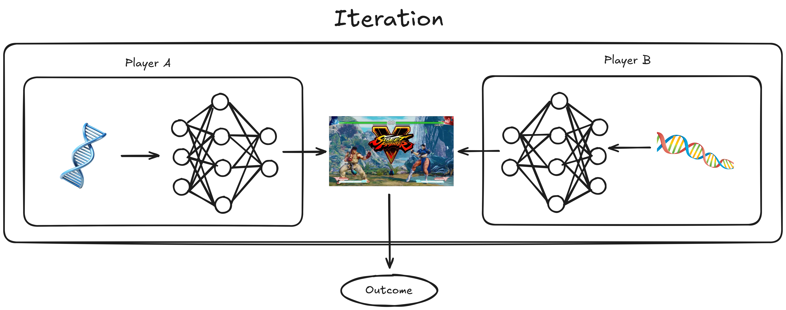

# Adversarial Evolutionary Algorithm for Fighting Games

## Environment Setup

Before running the script, you must ensure that you have the correct environment to set up the repository. This repository is designed to specifically target Ubuntu 22.04 LTS, so use of a VM or WSL in Windows is encouraged to make it work without hassle. If you don't want to use a VM or WSL, consider using a devcontainer included in the repo. Read [this doc](https://code.visualstudio.com/docs/devcontainers/containers) to learn more about devcontainers. In this case, [Docker](https://www.docker.com/get-started/) should be installed.

Once you have the correct OS setup, install `uv` on your system. `uv` is a python package manager, read more [here](https://docs.astral.sh/uv/getting-started/installation/). The installation script can be run by executing:

```bash
curl -LsSf https://astral.sh/uv/install.sh | sh
```

Certain system dependencies are also needed for the various project dependencies to function. Install these by running:

```bash
bash .devcontainer/setup.sh
```

Once everything is set up, project dependencies are installed by running:

```bash
uv sync
```

Then, finally, ROMs can be imported by running:

```bash
uv run AutoROM
```

## Run Scripts

The main script to run experiments is `interleaved_evolution.py`. An example of how to run this script is detailed in `run_experiments.sh` in the root folder. The script have flags that can affect the NEAT config used, the population size, the rewards, etc. However, most of these are ignored and a grid search currently overrides all the flags. If you wish to edit the running configurations, edit the `grid` dictionary in line 818. The grid is currently set up to run all of the experiments detailed in the report plus a few extra, so modifications is not necessary to replicate the results of the report. As detailed in the bash file, the code can be ran with:

```bash
uv run python interleaved_evolution.py \
    --config neat_config_boxing.ini \
    --results results_boxing \
```

There are some other scripts that serve auxiliary functions to the experiments:
- `ie_compete_genome.py` matches two genomes together for some number of rounds. This is used for running the hall-of-fame experiment.
- `ie_play_saved.py` also matches two genome together, but either render it for human observation or save as a `.mp4` video.
- `plot_compare_results_heatmap.py` converts match-wise data into a heatmap.

To run the first two scripts described, you must need a saved genome obtained by running the main experiment first. These are `.pkl` files, and have specific population designation of `_A` or `_B` in them. For example, `ie_compete_genome.py` can be ran by:

```bash
uv run python ie_compete_genome.py \
    --config neat_config_boxing.ini \
    --genome_a genome_A.pkl \
    --genome_b genome_B.pkl \
    --rounds 9
```

## Interleaved Evolution Visualization




## Useful Resources

https://gymnasium.farama.org/introduction/basic_usage/